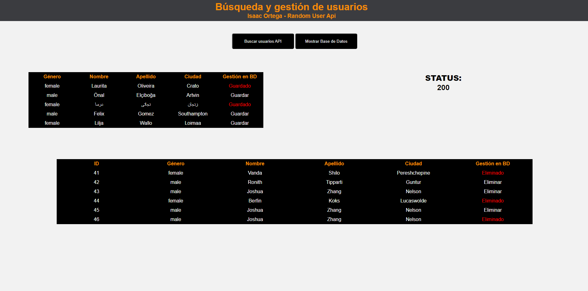

# Test: consumir API randomuser y guardar usuarios en Base de Datos:

### Enunciado solicitado por la empresa:

- Recoger datos de usuarios de la API [randomUser](https://randomuser.me) usando CURL con PHP
- Trabajar con Programación Orientada a Objetos
- Mostrar esos datos con AJAX en un archivo HTML
- A poder ser, guardar dichos datos en una base de datos (sin especificar el tipo)

### Lenguajes utilizados:
- PHP (POO)
- Javascript
    - AJAX
- MySQL

### Cómo se realizó:

- Se crearon las clases de PHP
- Se consumió la API utilizando CURL

***Fragmento:***
```
public function consult()
    {
        try {
            if ($this->handler == null) {
                $this->handler = curl_init();
            }
            if (strtolower($this->method === 'get')) {

                curl_setopt_array($this->handler, [
                    CURLOPT_URL => $this->url,
                    CURLOPT_RETURNTRANSFER => true,
                    CURLOPT_HTTPGET => true,
                    CURLOPT_HEADER => 0,
                    CURLOPT_POST => false
                ]);
            }
            $this->data = curl_exec($this->handler);

            $this->status = curl_getinfo($this->handler);
        } catch (Exception $e) {
            die($e->getMessage());
        }
    }

```
- Creación del DOM con HTML5
- Creación de controladores con PHP, consumiendo la API a través de las clases
- Controladores para guardar y eliminar datos de usuarios en bases de datos SQL

***Se decidió trabajar con bases de datos SQL, ya que al ser relacionales son más consistentes y tienen un uso más extendido en el ámbito laboral***


- Creación de vistas en Javascript para mostrar datos en tablas por medio de AJAX

***Fragmento:***
```
$("#usersContainer").append(usersTable);
            $(".rows").each(function(index) {
              $(this).click(function(each) {
                let userSaved = $(this).closest(".rows").find("td");
                let gender = userSaved[0].innerHTML;
                let nameUser = userSaved[1].innerHTML;
                let lastname = userSaved[2].innerHTML;
                let city = userSaved[3].innerHTML;
                //La función sendUser() se ejecuta dentro del for, con los parámetros
                //indicados, pero se construye fuera del bucle para mayor eficiencia
                sendUser(gender, nameUser, lastname, city, userSaved);
              })
            })

```


## <span style="color:orange">Instrucciones para hacerlo funcionar:</span>

- Modificar contraseña y usuario en variables de entorno (archivo: connection_env.php)
- Crear base de datos llamada: randomUser
```
CREATE DATABASE randomUser;

```
- Crear tablas en la base de datos

```
CREATE TABLE userData (
id INT AUTO_INCREMENT PRIMARY KEY NOT NULL,
gender VARCHAR(20),
nameUser VARCHAR(200),
lastname VARCHAR(300),
city VARCHAR(300)
);

```

